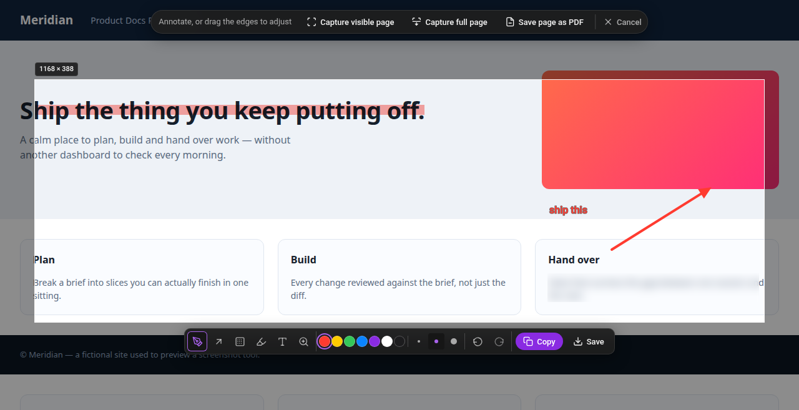

<div align="center">


# NhakoCapture

**Snapshot tool, rebuilt for browser of your choice.**

Freeze the page, frame a region, mark it up, copy. Without ever leaving the tab.

<p>
  
  
  
  
  
</p>

</div>

<div align="center">
  
  <sub><i>Not a mockup — rendered by the extension's own code and captured automatically. See <a href="#development">Development</a>.</i></sub>
</div>

---

## Why this exists

Opera has a screenshot tool that is one keystroke and then out of your way:
`Ctrl+Shift+5`, the page freezes, you drag a box, scribble a red arrow on the
thing you are pointing at, and paste it into a chat. You never leave the tab and
you never think about it.

Brave has nothing equivalent, and the extensions that claim to fill the gap break
the part that mattered, they throw you into a new tab, or make you save a file
and reopen it somewhere else to annotate, or want an account. The friction is not
that screenshots are hard. It is that a two-second reflex becomes a twelve-second
errand, and it interrupts the thought that prompted the screenshot.

NhakoCapture rebuilds that reflex.

## Features

| | |
|---|---|
| **Frozen page** | The viewport is captured *before* any UI appears, so the page stops dead and the extension's own chrome can never end up in your screenshot. |
| **Live framing** | Drag to select. Eight resize handles, draggable interior, arrow-key nudge. A live `W × H` badge showing the real output size, not the CSS size. |
| **Annotate in place** | Pencil, arrow, blur, highlight and text — over the page you are already looking at. Seven inks, three stroke weights. |
| **Real redaction** | Blur replaces pixels with a blurred copy of themselves. The original values are not recoverable from the exported file. |
| **Full undo** | Every mark is a record, not paint. `Ctrl+Z` / `Ctrl+Shift+Z` all the way back. |
| **Copy or save** | Straight to the clipboard, or a real Save-As dialog that lets you pick where it goes. |
| **Whole page as PNG** | Scroll-and-stitch, with sticky headers neutralised and lazy images woken first. |
| **Whole page as PDF** | The entire document, not just the viewport. |
| **Private by construction** | No network calls, no accounts, no telemetry, no analytics. Nothing leaves the machine. |

## Install

Not on the Web Store. Load it unpacked:

1. Clone this repository.
2. Open your browser's extensions page — `brave://extensions`,
   `chrome://extensions` or `edge://extensions`.
3. Turn on **Developer mode**, top right.
4. Click **Load unpacked** and select the **repository root** — the folder
   containing `manifest.json`.
5. Pin it from the puzzle-piece menu so the shortcut has somewhere to land.

Chromium assigns `Ctrl+Shift+5` automatically. Check or change it at
`brave://extensions/shortcuts`.

## Using it

Press `Ctrl+Shift+5`, or click the toolbar icon.

The page freezes under a dim scrim. From there:

- **Drag** anywhere to frame a region.
- **Capture visible page** takes the viewport — what is on screen, nothing more.
- **Capture full page** scrolls the document and stitches the whole thing into
  one image, then opens it in the editor window.
- **Save page as PDF** takes the entire document as a PDF instead.

Once you have a frame, the tool rail appears. Pick a tool, mark it up, then
**Copy** or **Save**.

### About full page

It is a second gear, not the default, and it behaves like one:

- It takes about **half a second per screenful**, because Chromium rate-limits
  tab capture to roughly two calls a second. The extension icon counts the
  tiles while it works — `3/9`, or a percentage past nine screenfuls.
- The page is swept once first, to wake lazily-loaded images that have never
  been scrolled into view.
- Fixed headers, cookie bars and chat widgets appear **once**, at the top,
  instead of banding down every screenful.
- **Esc cancels.** Your scroll position and every element it touched go back
  exactly as they were, on cancel, on failure, and on success alike.
- Pages taller than 16384 device pixels are **capped** there rather than
  downscaled, and the editor says so. A sharp screenshot of the first sixteen
  thousand pixels is worth more than a soft one of everything.
- On a page with nothing below the fold the button is disabled and says why —
  a full-page capture would be the visible one, byte for byte.

### Keyboard

| Key | Does |
|---|---|
| `Ctrl+Shift+5` | Open NhakoCapture |
| `P` `A` `B` `H` `T` `Z` | Pencil · Arrow · Blur · Highlight · Text · Zoom |
| `Ctrl+Z` / `Ctrl+Shift+Z` | Undo / redo |
| `Ctrl+C` | Copy and close |
| `Ctrl+S` | Save and close |
| `↑ ↓ ← →` | Nudge the frame 1px |
| `Shift` + arrows | Nudge 10px |
| `Alt` + arrows | Resize the frame |
| `Esc` | One step back — release the tool, clear the frame, then exit |

## Permissions

Every permission, and why it is there. The last one deserves an explanation.

| Permission | Why |
|---|---|
| `activeTab` | Read the current tab so it can be captured. Granted only when *you* invoke the extension, and only for that tab. |
| `scripting` | Inject the overlay into the page you are capturing. |
| `storage` | Used by the restricted-page fallback editor. |
| `downloads` | Open a real Save-As dialog rather than dropping files silently into your downloads folder. |
| `offscreen` | Write images to the clipboard. A service worker has no Clipboard API, and a content script on an `http://` page is not a secure context, so `navigator.clipboard` does not exist there. |
| `debugger` | **Only** for `Save page as PDF`. Chromium exposes `Page.printToPDF` through the DevTools protocol and nowhere else. It is attached for the second the render takes and detached immediately in a `finally` block, and Chromium shows its "started debugging this browser" banner for that moment. If attaching fails, it falls back to the normal print dialog. It is never used for anything else. |

## How it works

No bundler, no framework, no dependencies — the source you read is the code that
runs.

```
manifest.json          Manifest V3
icons/                 generated by tools/make-icons.py
src/
├── background.js      captures FIRST, then injects; routes messages
├── offscreen.js       clipboard writes and blob URLs
├── lib/
│   ├── namespace.js   module registry (executeScript cannot use ES modules)
│   └── geometry.js    CSS ⇄ device-pixel maths
├── engine/
│   ├── ops.js         append-only annotation list; undo/redo
│   ├── render.js      replays ops over the bitmap
│   └── stitch.js      composes full-page tiles onto one canvas
├── overlay/
│   ├── inject.js      lifecycle, keyboard, teardown
│   ├── stage.js       shadow host, frozen backdrop, scrim
│   ├── selection.js   frame, handles, dimension badge
│   ├── fullpage.js    scroll-and-stitch loop, sticky/lazy handling
│   ├── annotate.js    annotation canvas and tools
│   ├── rail.js        tool rail
│   ├── toolbar.js     command pill
│   ├── tokens.css     design tokens
│   └── overlay.css    overlay UI
└── fallback/          editor window: brave:// pages, and full-page captures
    ├── editor.html
    └── editor.js
tools/                 icon generation and the test suite
```

Three decisions shape everything else:

**Capture before you draw.** The background worker screenshots the viewport
before the overlay exists. That makes it structurally impossible for the
extension's own UI to appear in your capture, and it is what produces the frozen
page.

**Everything lives in a shadow root.** The overlay mounts with `all: initial` on
`:host`, so no page stylesheet can reach our chrome and none of ours disturbs the
page. Design tokens are redeclared on `:host` because custom properties *do*
inherit through a shadow boundary — the one thing Shadow DOM does not isolate.

**Marks are records, not paint.** The image is produced by replaying an op list
over the bitmap. Painting straight onto a canvas is simpler right up until
someone wants their last stroke back.

## Development

```bash
./tools/test.sh              # everything below
node tools/test-geometry.mjs # pixel maths, incl. a fuzz pass
node tools/test-selection.mjs# framing, clamping, handle flipping
node tools/test-ops.mjs      # undo/redo history semantics
node tools/test-background.mjs # service worker, via a stubbed chrome
node tools/test-modules.mjs  # injection order and the module graph
node tools/preview.mjs out/  # drives real Chromium over CDP
```

`tools/preview.mjs` is worth knowing about. It launches headless Chromium over
the DevTools Protocol — no dependencies, using Node 22's built-in `WebSocket` —
produces the backdrop with a real `Page.captureScreenshot`, and drives **real
dispatched input**, so the pointer path under test is the one you get. It
asserts things a unit test cannot: that the scrim leaves the framed region
pixel-identical to the page, that blur genuinely destroys local contrast, that
three launches leave exactly one overlay in the DOM.

It also produces the screenshot at the top of this file:

```bash
node tools/preview.mjs out/ --hero
```

Regenerate the icons with `python3 tools/make-icons.py`.

## Where it differs from Opera

Deliberately, and it is short:

- **Zoom is a magnifier loupe, not a canvas zoom.** Opera's editor is a separate
  surface, so it can scale freely. This overlay sits 1:1 over the live page —
  scaling it would desync the frame from the pixels it depicts.
- **No sticker or emoji picker.** An asset set and a picker UI for little return.
- **No selfie camera.** It needs webcam permission, which is a poor trade for a
  tool whose main promise is that nothing leaves your machine.
- **No horizontal stitching.** Pages wider than the viewport are captured at
  viewport width. Only the document scroller is driven, so content inside an
  inner `overflow: scroll` element is captured as it appears.
- **No per-tile progress for screen readers.** The start and end of a full-page
  capture are announced; the middle is deliberately quiet, because a polite
  live region firing twelve times is chatter rather than information.
- **Infinite-scroll feeds are not special-cased.** A page that grows as you
  scroll it is captured to whatever extent existed when the capture started.

## Status

Version 2.0.0 is a ground-up rebuild of v1.0. Capture, framing, annotation,
copy, save, PDF, full-page scroll-and-stitch and the restricted-page editor
window are all implemented, with **435 unit checks and 190 browser checks**
covering them (`./tools/test.sh`).

The browser checks drive a real Chromium over the DevTools protocol: real
input, real shadow DOM, real computed styles. They are not a substitute for
loading the extension in Brave, and the task list tracks which behaviours have
been verified there and which have only been unit-tested.

Remaining work is tracked in [`todo.md`](todo.md).

## Credits

Built by **kimzam** to restore the Opera feel to browser of your choice.
