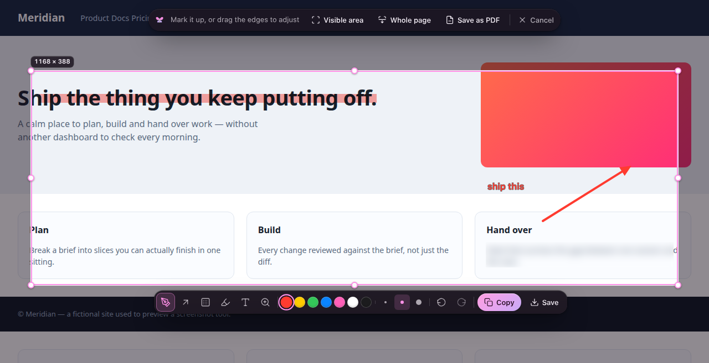
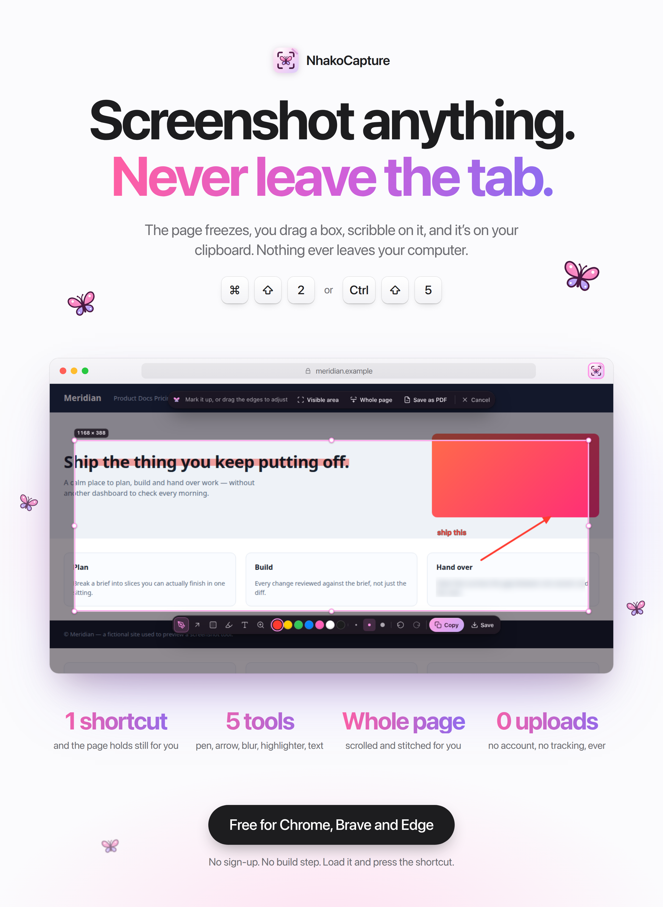

<div align="center">


# NhakoCapture

**Screenshot anything. Never leave the tab.**

Press one shortcut. The page holds still, you drag a box around what matters,
scribble on it, and it's on your clipboard, ready to paste.

<p>
  
  
  
  
  
</p>

</div>

<div align="center">
  
  <sub><i>Not a mockup. The extension's own code drew this, and a script captured it. See <a href="#for-developers">For developers</a>.</i></sub>
</div>

---

## Why it exists

Opera has a screenshot tool that gets out of your way. One shortcut, the page
freezes, you drag a box, put a red arrow on the thing you mean, and paste it into
a chat. You never leave the tab and you never think about it.

Most other browsers don't have that. The extensions that try tend to lose the
part that mattered: they open a new tab, or make you save a file and open it
somewhere else to draw on it, or want you to sign up first. Screenshots aren't
hard. The problem is that a two-second habit turns into a twelve-second chore,
and it breaks the thought you were having.

NhakoCapture brings the two-second version back. It's part of the Nhako family,
alongside [Nhako Tools](https://tools.nhako.com) and
[NhakoSearch](https://search.nhako.com): free, private, and made to feel good to use.

## What it does

| | |
|---|---|
| **The page holds still** | The screen is captured *before* anything of ours appears, so the page stops exactly as it was, and our buttons can never end up in your screenshot. |
| **Drag to frame** | Draw a box, then fine-tune it with eight round handles, by dragging the middle, or with the arrow keys. A small label shows the real size of the image you'll get. |
| **Mark it up right there** | Pen, arrow, blur, highlighter and text, on top of the page you're already looking at. Seven colours, three line widths, and a magnifier for the fiddly bits. |
| **Blur that really hides things** | Blur replaces the pixels with a blurred copy of themselves. Nobody can un-blur the file you share. |
| **Undo everything** | Every mark can be taken back, one at a time, all the way to the start. |
| **Copy or save** | Straight to your clipboard as a real image, or to a proper Save dialog where you choose the folder. |
| **The whole page, too** | It scrolls the page for you and stitches it into one tall image. Sticky headers show up once, not on every screenful. |
| **Or a PDF** | The entire page as a PDF, not just the part on screen. |
| **Private by design** | No internet connection, no account, no analytics. Nothing leaves your computer. |

## Install

It isn't on the Web Store yet, so you load it yourself. It takes a minute:

1. Download or clone this repository.
2. Open your browser's extensions page: `chrome://extensions`, `brave://extensions`
   or `edge://extensions`.
3. Turn on **Developer mode** (top right).
4. Click **Load unpacked** and pick the folder that contains `manifest.json`.
5. Pin NhakoCapture from the puzzle-piece menu so it's always one click away.

Needs Chrome, Brave or Edge **116 or newer**.

## How to use it

Press the shortcut, or click the butterfly in your toolbar.

| | Shortcut |
|---|---|
| Windows, Linux, ChromeOS | `Ctrl` `Shift` `5` |
| Mac | `⌘` `⇧` `2` (macOS keeps `⌘⇧5` for its own screenshot tool) |

Your browser might pick a different shortcut if another extension already uses
that one. Hover over the toolbar icon to see which one you have, and change it at
`chrome://extensions/shortcuts`.

The page dims and holds still. Then:

- **Drag** over anything to frame it.
- **Visible area** frames everything on screen.
- **Whole page** scrolls the page and captures all of it, then opens it in a new
  window for you to mark up.
- **Save as PDF** saves the entire page as a PDF.

Once you've framed something, the tool bar slides up underneath. Pick a tool,
draw, then hit **Copy** or **Save**. You'll see a quick flash and a tick, and
the overlay gets out of your way. You can keep adjusting the frame's edges while
a tool is selected. A stray click outside the frame won't throw your drawing away.

Press the shortcut again at any time to close it.

### Keyboard

| Key | What it does |
|---|---|
| `Ctrl` `Shift` `5` / `⌘` `⇧` `2` | Open NhakoCapture, or close it again |
| `P` `A` `B` `H` `T` `Z` | Pen, Arrow, Blur, Highlighter, Text, Magnifier |
| `Ctrl` `Z` / `Ctrl` `Shift` `Z` | Undo / redo (`⌘` on a Mac) |
| `Ctrl` `C` | Copy and close |
| `Ctrl` `S` | Save and close |
| `←` `↑` `→` `↓` | Nudge the frame by 1 pixel |
| `Shift` + arrows | Nudge by 10 pixels |
| `Alt` + arrows | Resize the frame |
| `Esc` | One step back: put the tool down, then clear the frame, then close |

### Whole-page captures, honestly

They're the slower option, and here's why:

- **It takes about half a second per screenful.** Browsers only allow about two
  captures a second. The toolbar icon counts along while it works: `3/9`, or a
  percentage on long pages.
- **It scrolls through the page first**, so pictures that only load when you
  scroll to them are there in the final image.
- **Sticky headers, cookie banners and chat bubbles appear once**, at the top,
  instead of repeating down the whole image.
- **Switching tabs pauses it.** It carries on when you come back, so it never
  captures the wrong tab by mistake.
- **`Esc` stops it.** The page goes back exactly where it was, whether you stop
  it, it fails, or it finishes.
- **Very long pages are cut off at 16,384 pixels** instead of being shrunk into a
  blurry mess, and the editor tells you when that's happened.
- **If the whole page already fits on screen**, the button says so rather than
  giving you the same picture twice.

## Permissions, and why each one is there

| Permission | Why it's needed |
|---|---|
| `activeTab` | To capture the tab you're on. Only granted when *you* press the shortcut or click the icon, and only for that tab. |
| `scripting` | To put the overlay on the page you're capturing. |
| `storage` | To hand a capture to the editing window on pages where the overlay can't run. |
| `downloads` | To open a real Save dialog, so you pick where the file goes. |
| `offscreen` | To copy images on plain `http://` pages, where the page itself isn't allowed to use the clipboard. On those pages the copy pastes into chats and documents, but not into image editors, and NhakoCapture tells you so. |
| `debugger` | **Only** for *Save as PDF*. It's the only way a browser lets an extension make a PDF of a page. It's switched on for the second the PDF takes and switched off straight after, and your browser shows a "started debugging" banner during that time. If it can't be used, you get the normal print dialog instead. It's never used for anything else. |

## What's new in 2.1

- **A new look.** A frosted, dusk-tinted toolbar in the Nhako pink and lavender,
  round handles, and small spring animations when things appear. A shutter flash
  and a tick tell you the copy worked. Everything still respects your system's
  *reduce motion* and high-contrast settings.
- **A new icon.** A butterfly caught in a capture frame, drawn to stay sharp even
  at 16 pixels.
- **Plainer words.** "Visible area", "Whole page", "Pen", "Highlighter",
  "Magnifier". Messages say what happened ("Couldn't copy that. Try again?")
  instead of "Copy failed".
- **Fixed: switching tabs during a whole-page capture** could stitch the other
  tab into your image. It now pauses until you come back.
- **Fixed: some websites' own styles could shrink or move the overlay**, leaving
  it out of line with the page. The overlay now holds its position whatever the
  site does.
- **Fixed: after *Visible area*, the top bar couldn't be clicked.** It now just
  fades back and comes forward when you point at it.
- **Fixed: the tooltip always said `Ctrl+Shift+5`**, even on a Mac where the
  shortcut is `⌘⇧2`. It now shows the shortcut you actually have.
- **Fixed: cancelling the Save dialog** could show an error on some browser
  versions. Changing your mind isn't an error.
- **Faster long pen strokes.** Drawing a long line no longer slows down as it
  grows.
- Screenshots are now named like macOS names them:
  `NhakoCapture 2026-09-29 at 14.03.22.png`.

## How it's built

No bundler, no framework, no dependencies. The code you read is the code that runs.

```
manifest.json          Manifest V3
icons/                 made from docs/brand by tools/make-icons.py
docs/brand/            the logo (SVG masters and a PNG)
docs/launch/           the launch poster, as HTML and PNG
src/
├── background.js      captures FIRST, then adds the overlay; routes messages
├── offscreen.js       clipboard fallback and blob URLs
├── lib/
│   ├── namespace.js   module registry (injected scripts can't use ES modules)
│   ├── geometry.js    CSS pixel ⇄ device pixel maths
│   └── clipboard.js   writes the PNG from the page you clicked in
├── engine/
│   ├── ops.js         the list of marks; undo and redo
│   ├── render.js      replays the marks over the image
│   └── stitch.js      joins whole-page tiles into one image
├── overlay/
│   ├── inject.js      start-up, keyboard, tidy-up
│   ├── stage.js       shadow root, frozen backdrop, dimming, flash
│   ├── selection.js   frame, handles, size label
│   ├── fullpage.js    the scroll-and-capture loop
│   ├── annotate.js    drawing tools
│   ├── rail.js        tool bar
│   ├── toolbar.js     top bar
│   ├── tokens.css     design tokens ("dusk glass")
│   └── overlay.css    overlay styles and motion
└── fallback/          the editing window, for browser pages and whole-page captures
tools/                 tests, icon and poster rendering
```

Three decisions shape everything else:

**Capture first, then draw.** The screen is captured before the overlay exists.
That's why our own buttons can never appear in your screenshot, and it's what
makes the page "freeze".

**Everything lives in a shadow root.** No website's styles can reach the overlay,
and the overlay's styles can't disturb the website. The one thing a shadow root
doesn't shield, the host element's own size and position, is pinned inline so a
site's CSS can't move it either.

**Marks are records, not paint.** The final image is made by replaying a list of
marks over the capture. That's what makes undo possible.

### The design

The look comes from the Nhako family. [Nhako Tools](https://tools.nhako.com) gave
it the brand pink (`#FF91E7`) and the rule of one typeface, San Francisco,
through the system and never downloaded. NhakoSearch and NeraOS gave it lavender
(`#C3A6F0`), the plum ink, the butterfly, and the striped progress bar. The feel
comes from macOS's own screenshot tool: frosted dark glass, hairline edges, and
springs that settle instead of bouncing.

The toolbar stays dark on purpose. It has to be readable over a white article and
over a black video. Every text colour's contrast is worked out and written next
to it in [`tokens.css`](src/overlay/tokens.css), and each one clears WCAG AA even
with a pure white page behind the glass.

## For developers

```bash
./tools/test.sh
```

That runs everything: about 480 unit checks and 218 checks in a real browser.

```bash
node tools/preview.mjs out/
```

This drives a real headless Chromium with real mouse and keyboard input, using
nothing but Node 22. It checks things a unit test can't: that the dimming leaves
the framed area pixel-for-pixel untouched, that blur really destroys detail, that
a website's own CSS can't move the overlay, and that pressing the shortcut three
times leaves exactly one overlay on the page.

It also makes the screenshot at the top of this page:

```bash
node tools/preview.mjs out/ --hero
```

To rebuild the brand assets:

```bash
python3 tools/make-icons.py
```

```bash
node tools/render-poster.mjs
```

## Where it differs from Opera

On purpose, and not by much:

- **Zoom is a magnifier, not a zoomed canvas.** The overlay sits exactly on top
  of the live page, so zooming it would pull the frame away from what it's
  showing. The magnifier follows your pointer; click to park it, click again to
  let it go.
- **No stickers or emoji.** A lot of extra weight for very little.
- **No selfie camera.** It would need webcam access, and the whole promise is
  that nothing leaves your computer.
- **Whole-page captures go down, not sideways.** Wide pages are captured at the
  width of your window, and scrolling boxes inside a page are captured as they
  look on screen.
- **Endless feeds aren't chased.** A page that keeps growing as you scroll is
  captured as far as it existed when you started.

## Launch poster

<div align="center">
  
</div>

## Status

Version 2.1. Everything described above works. The browser checks drive a real
Chromium with real input, but they don't replace trying the extension in your own
browser, and that hands-on pass is the one piece of work still open.

## Credits

Made by **kimzam**, to bring the Opera feel to whichever browser you like.
Part of the Nhako family.
